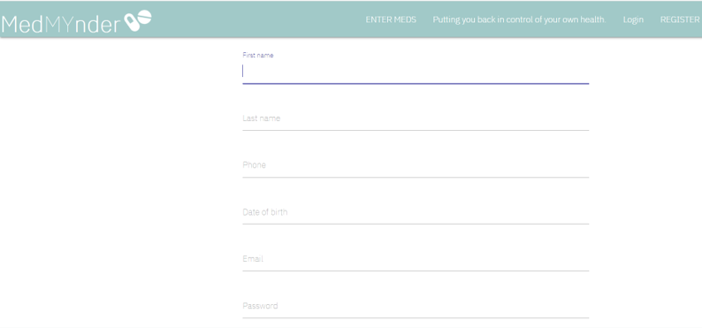

# MedMYnder

This app is currently in development but you can clone it onto your machine and view it using the following steps. 

## Starting the app locally

Please note that the most complete branch to work with at the moment of writing is called ravi. Please checkout this branch in order to proceed with these steps.

First make sure you have 
```
mongod 
```
running in a separate terminal.

Then install front and backend dependencies in the client directory.
```
cd client
yarn install
```

Then go back to the root directory 
```
cd ..
```
and run 
```
yarn install
```
 
After both installations complete, and mongo is running, run the following command in your terminal:

```
yarn start
```

That's it, our app should be running on <http://localhost:3000>. The Express server should intercept any AJAX requests from the client.

